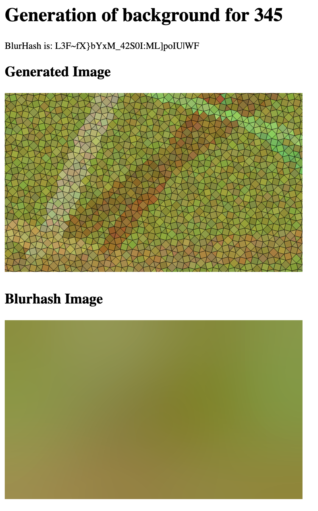
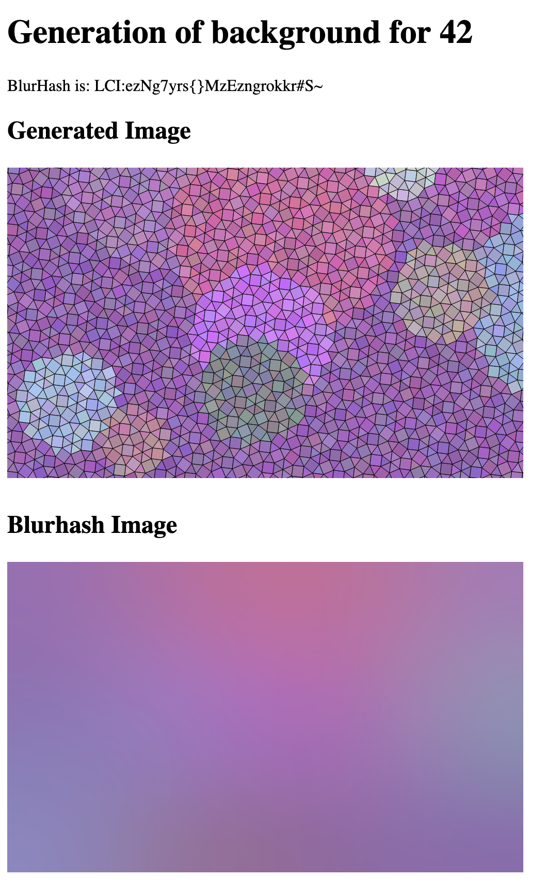
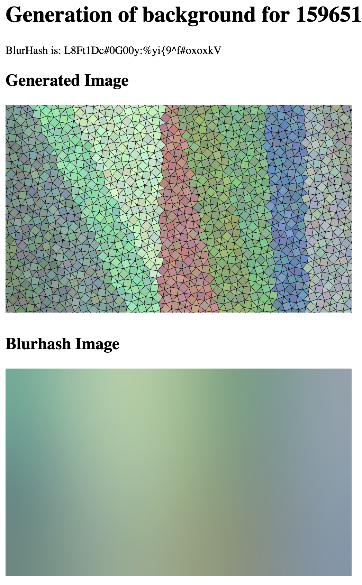

# backgen

Creates random background images from a given id. It will create a random image,
as well as its blurhash equivalent.

## Example:



# How to use

## Command line

Generate a random background
```sh
$ cargo run --bin backgen
blurhash is: L48ZJuO_TnDJ_UmWzTD|n.vPgnxh
```
It will generates: `output.gen.png` and `output.blur.png`..

Genreate a defined image:
```sh
$ cargo run --bin backgen -- --id 42 --gen-dest output.gen.png --blur-dest output.blur.png
blurhash is: LCI:ezNg7yrs{}MzEzngrokkr#S~
```

## Web interface

Simply launch it via:
```sh
$ cargo run --bin backgen-web
```
Then go to http://localhost:5000

# Technologies

This project is built upon:
  * wallrnd
  * blurhash
  * resvg
  * usvg

